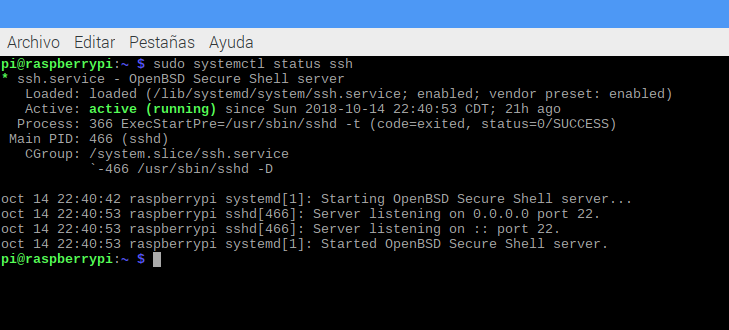
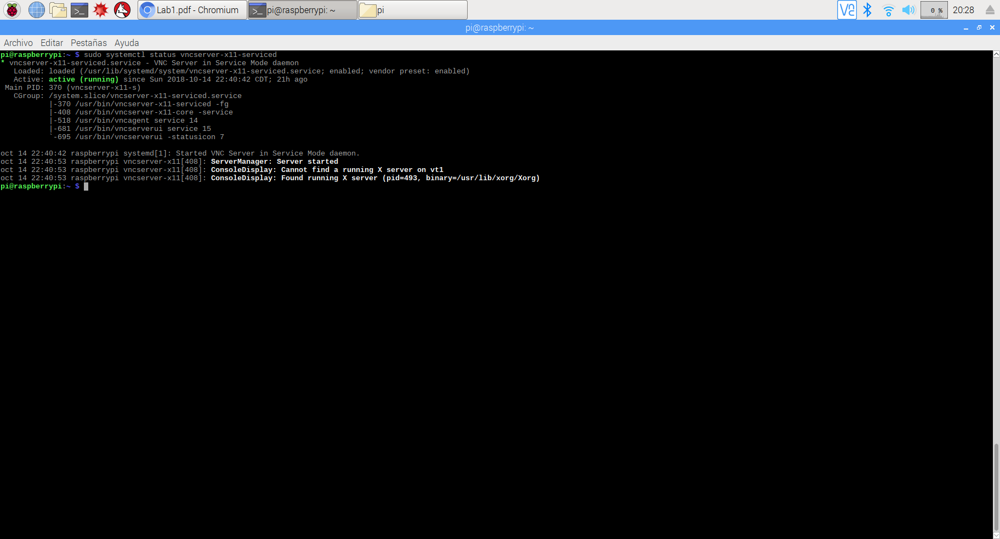

# Uso de la raspberry pi 3 B+

## Mediante el sistema operativo raspbian

Instalar el sistema operativo en la memoria micro SD consiste en utilizar el comando `dd` el cual, copia la imagen del sistema operativo en el dispositivo seleccionado, creando las particiones necesarias para que la memoria se convierta en un dispositivo de arranque. Una vez copiado el sistema operativo en la memoria podemos conectarla a la raspberry y energizarla.

 Se puede conectar teclado y ratón a los puertos USB así como un monitor en la salida HDMI. De esta forma la raspberry trabaja como una computadora convencional con un entorno gráfico.

## Mediante conexión por SSH

Para conectarse por ssh a la raspberry primero se debe de establecer una conexión, esto se puede hacer modificando el archivo /etc/wpa_supplicant/wpa_supplicant.conf en el se debe agregar el nombre de la red y la contraseña si existiese.
Una vez conectado podemos activar el servicio SSH ya que por defecto está deshabilitado.
Con el comando `sudo systemctl status ssh` verificamos el estado del servicio, comprobando que se encuentra desactivado, usamos el comando `sudo systemctl start ssh` para iniciarlo, y una vez iniciado escribimos el comando `sudo systemctl enable ssh` para habilitarlo permanentemente.

Para conectarse a la raspberry, desde una computadora con sistema operaivo linux conectada a la misma red, buscamos los dispositivos con el puerto 22 abierto (puerto ssh) con el comando `nmap` 

Una vez localizada la dirección de la raspberry procedemos a ejecutar el comando ssh para conectarnos a la tarjeta.

## Mediante conexión por VNC

Para usar VNC, al igual que con ssh, es necesario habilitar el servicio en la raspberry con .
`sudo systemctl status vncserver-x11-serviced`
`sudo systemctl start vncserver-x11-serviced`
`sudo systemctl enable vncserver-x11-serviced`

Se obtiene la dirección ip de la tarjeta de la misma manera que con ssh.
Al final nos conectamos usando la aplicación VNC viewer.

## Mediante UART
Antes de poder ultilizar la conexión por uart es necesario habilitarlo en la raspberry, esto se hace en el archivo boot/config.txt que es lo más cercano a un bios en la raspberry. Al final del archivo añadimos las lineas
`uart_enable=1`
`core_freq=250`

Después de reiniciar la tarjeta, conectamos el modulo uart a los respectivos pines en la raspberry.

Ahora, desde la computadoracomprobamos que el módulo sea detectado y tenga los servicios suficientes para que podamos realizar la conexión mediante el comando screen.

## Elaborado por:
    Martínez Aguilar Joaquín

    Martínez Gallegos Jesús